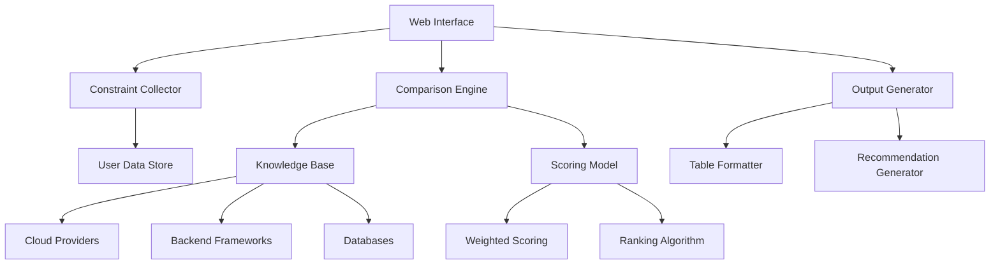

# Design Document: Technical Referee Tool

## Overview

The Technical Referee Tool is a web-based decision support system that helps developers and technical teams make informed technology choices. Built on Multi-Criteria Decision Analysis (MCDA) principles, the system collects user constraints, evaluates technical options against weighted criteria, and provides structured recommendations with clear trade-off explanations.

The system follows a three-phase workflow: constraint collection, multi-criteria evaluation, and structured output generation. Rather than providing generic comparisons, the tool delivers contextual recommendations tailored to specific user priorities and constraints.

## Architecture

The system uses a modular architecture with clear separation between data collection, evaluation logic, and presentation:



### Core Components

- **Web Interface**: Single-page application for user interaction
- **Constraint Collector**: Captures and validates user input parameters
- **Comparison Engine**: Performs multi-criteria evaluation using domain knowledge
- **Output Generator**: Creates structured comparison tables and recommendations
- **Knowledge Base**: Domain-specific evaluation criteria and scoring rules
- **Scoring Model**: Weighted scoring algorithm with priority-based adjustments

## Components and Interfaces

### Constraint Collector

**Purpose**: Capture and validate user constraints and priorities

**Interface**:
```typescript
interface UserConstraints {
  budget: 'low' | 'medium' | 'high';
  scale: {
    users: number;
    traffic: 'low' | 'medium' | 'high';
  };
  team: {
    skillLevel: 'junior' | 'mixed' | 'senior';
    experience: string[];
  };
  timeline: 'immediate' | 'short' | 'medium' | 'long';
  priorities: {
    cost: number;           // 1-5 weight
    performance: number;    // 1-5 weight
    easeOfUse: number;     // 1-5 weight
    scalability: number;   // 1-5 weight
    vendorLockIn: number;  // 1-5 weight (higher = more important to avoid)
  };
}
```

**Responsibilities**:
- Validate constraint inputs
- Normalize priority weights
- Store user session data

### Comparison Engine

**Purpose**: Evaluate technical options against weighted criteria

**Interface**:
```typescript
interface ComparisonEngine {
  evaluate(options: TechnicalOption[], constraints: UserConstraints): EvaluationResult;
}

interface TechnicalOption {
  name: string;
  category: 'cloud' | 'backend' | 'database' | 'frontend';
  metadata: Record<string, any>;
}

interface EvaluationResult {
  scores: OptionScore[];
  rankings: RankedOption[];
  tradeOffs: TradeOffAnalysis;
}
```

**Responsibilities**:
- Apply domain-specific scoring rules
- Calculate weighted scores based on user priorities
- Generate trade-off analysis
- Rank options by total weighted score

### Knowledge Base

**Purpose**: Store domain-specific evaluation criteria and scoring logic

**Structure**:
```typescript
interface DomainKnowledge {
  category: string;
  criteria: EvaluationCriteria[];
  scoringRules: ScoringRule[];
}

interface EvaluationCriteria {
  name: string;
  weight: number;
  scoringFunction: (option: TechnicalOption) => number;
}
```

**Domain Categories**:
- **Cloud Providers**: AWS, GCP, Azure evaluation logic
- **Backend Frameworks**: Node.js, Django, Spring Boot comparison rules
- **Databases**: PostgreSQL, MongoDB, MySQL scoring criteria

### Output Generator

**Purpose**: Format evaluation results into structured recommendations

**Interface**:
```typescript
interface OutputGenerator {
  generateComparison(result: EvaluationResult): ComparisonOutput;
}

interface ComparisonOutput {
  comparisonTable: ComparisonTable;
  prosAndCons: ProsCons[];
  tradeOffExplanation: string;
  finalRecommendation: Recommendation;
  alternativeScenarios: AlternativeScenario[];
}
```

## Data Models

### Core Data Structures

```typescript
// User input model
interface UserSession {
  id: string;
  constraints: UserConstraints;
  selectedOptions: TechnicalOption[];
  evaluationHistory: EvaluationResult[];
  createdAt: Date;
}

// Evaluation scoring model
interface OptionScore {
  option: TechnicalOption;
  criteriaScores: Record<string, number>;
  weightedScore: number;
  normalizedScore: number; // 0-100 scale
}

// Recommendation model
interface Recommendation {
  recommendedOption: TechnicalOption;
  confidence: number; // 0-1 scale
  reasoning: string;
  keyFactors: string[];
  warnings: string[];
}

// Trade-off analysis model
interface TradeOffAnalysis {
  strongestOption: Record<string, TechnicalOption>;
  weakestOption: Record<string, TechnicalOption>;
  compromises: Compromise[];
}

interface Compromise {
  description: string;
  impact: 'low' | 'medium' | 'high';
  affectedCriteria: string[];
}
```

### Domain-Specific Models

```typescript
// Cloud provider specific data
interface CloudProviderData {
  name: string;
  pricingModel: 'pay-as-you-go' | 'reserved' | 'hybrid';
  serviceCount: number;
  enterpriseFeatures: string[];
  learningCurve: 'low' | 'medium' | 'high';
  marketShare: number;
}

// Backend framework specific data
interface BackendFrameworkData {
  name: string;
  language: string;
  developmentSpeed: number; // 1-10 scale
  communitySize: number;
  enterpriseAdoption: number; // 1-10 scale
  performanceRating: number; // 1-10 scale
}
```

## Correctness Properties

*A property is a characteristic or behavior that should hold true across all valid executions of a system—essentially, a formal statement about what the system should do. Properties serve as the bridge between human-readable specifications and machine-verifiable correctness guarantees.*

<function_calls>
<invoke name="prework">
<parameter name="featureName">technical-referee

### Property Reflection

After reviewing all properties identified in the prework analysis, several can be consolidated to eliminate redundancy:

- Properties 5.1-5.5 (priority emphasis) can be combined into a single comprehensive property about priority weighting
- Properties 4.1-4.3 (domain-specific criteria) can be combined into one property about domain knowledge application
- Properties 3.2, 3.3, 6.1, 6.2 (output content) can be consolidated into properties about comprehensive output generation

### Correctness Properties

Property 1: Constraint capture completeness
*For any* user session, when all constraint collection steps are completed, the system should capture budget, scale, team context, timeline, and priority rankings
**Validates: Requirements 1.1, 1.2, 1.3, 1.4, 1.5**

Property 2: Option count validation
*For any* comparison request, the system should accept exactly 2-3 technical options and reject requests with fewer than 2 or more than 3 options
**Validates: Requirements 2.1**

Property 3: Comprehensive criteria evaluation
*For any* set of technical options, the comparison engine should generate scores for all standard criteria (cost, performance, scalability, learning curve, vendor lock-in, maintainability) for each option
**Validates: Requirements 2.2, 2.3**

Property 4: Priority-based weighting
*For any* user priority configuration, changing priority weights should result in corresponding changes to final option rankings
**Validates: Requirements 2.4**

Property 5: Domain-specific criteria application
*For any* technology category (cloud, backend, database), the comparison engine should apply category-specific evaluation criteria appropriate to that domain
**Validates: Requirements 4.1, 4.2, 4.3, 4.4**

Property 6: Priority emphasis consistency
*For any* user priority setting, the system should emphasize criteria related to that priority in scoring calculations (e.g., cost priority emphasizes pricing and resource efficiency)
**Validates: Requirements 5.1, 5.2, 5.3, 5.4, 5.5**

Property 7: Comprehensive output generation
*For any* evaluation result, the output should include comparison table, pros/cons for each option, trade-off explanations, final recommendation with reasoning, and alternative scenarios
**Validates: Requirements 3.2, 3.3, 3.4, 3.5, 6.1, 6.2**

Property 8: Constraint change re-evaluation
*For any* existing evaluation, when user constraints are modified, the system should generate updated results that reflect the new constraint values
**Validates: Requirements 6.3**

Property 9: Trade-off impact quantification
*For any* comparison result, trade-off explanations should include specific descriptions of what is gained and lost when choosing each option
**Validates: Requirements 6.4**

## Error Handling

### Input Validation Errors
- **Invalid constraint values**: Return specific error messages for out-of-range or malformed inputs
- **Insufficient options**: Require minimum 2 options for comparison
- **Excessive options**: Limit to maximum 3 options to maintain comparison clarity
- **Missing priority weights**: Default to equal weighting with user notification

### Evaluation Errors
- **Unknown technology options**: Graceful degradation with generic scoring when domain knowledge is incomplete
- **Scoring calculation failures**: Fallback to simplified scoring algorithms
- **Knowledge base inconsistencies**: Log errors and use conservative estimates

### Output Generation Errors
- **Template rendering failures**: Provide plain text fallback format
- **Recommendation generation failures**: Return comparison data without final recommendation
- **Alternative scenario failures**: Skip alternative scenarios but provide main recommendation

## Testing Strategy

### Dual Testing Approach

The system will use both unit testing and property-based testing for comprehensive coverage:

**Unit Tests**: Focus on specific examples, edge cases, and integration points
- Test specific constraint input combinations
- Test known technology comparison scenarios (e.g., AWS vs GCP for startups)
- Test error conditions and edge cases
- Test UI component behavior and user interactions

**Property-Based Tests**: Verify universal properties across all inputs using QuickCheck-style testing
- Generate random constraint combinations and verify complete capture
- Generate random option sets and verify scoring completeness
- Generate random priority configurations and verify weighting effects
- Test with minimum 100 iterations per property to ensure comprehensive coverage

### Property Test Configuration

Each property-based test will:
- Run minimum 100 iterations due to randomization
- Reference its corresponding design document property
- Use tag format: **Feature: technical-referee, Property {number}: {property_text}**
- Generate realistic test data within valid constraint ranges

### Testing Framework

The system will use Jest for unit testing and fast-check for property-based testing in TypeScript/JavaScript environment. Each correctness property will be implemented as a single property-based test with appropriate generators for user constraints, technical options, and evaluation scenarios.